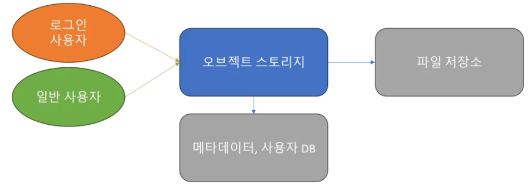

  <h1>📮 Object Storage</h1>
  

		<b>Kotlin + Spring을 통해 오브젝트 스토리지 구현하기</b>
	

	 

# 💡 주요 API
## 1️⃣ Auth (JWT)
### 회원가입
> POST /register

### 로그인
> POST /login

## 2️⃣ Storage
### 파일 업로드
> POST /upload

### 파일 리스트 조회
> GET /files

### 파일 상세 조회 (메타데이터)
> GET /files/{id}

### 파일 접근 권한 설정 (공개/비공개/암호)
> PUT /files/{id}/permission

### 파일 다운로드
> GET /download/{id}

- 이미지, 동영상, pdf 등 해당 파일을 직접 웹페이지에서 사용할 수 있도록 함
